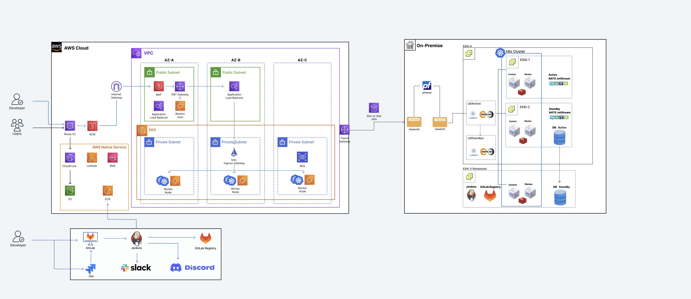
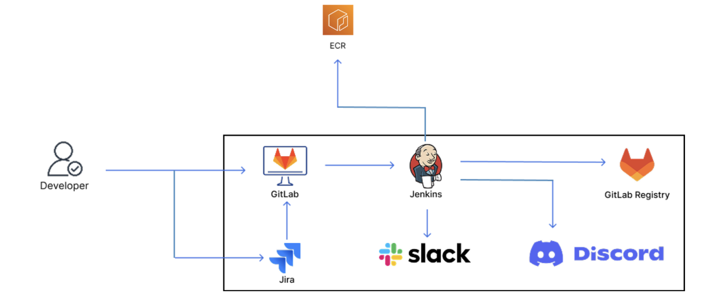
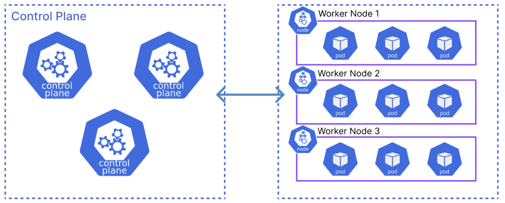
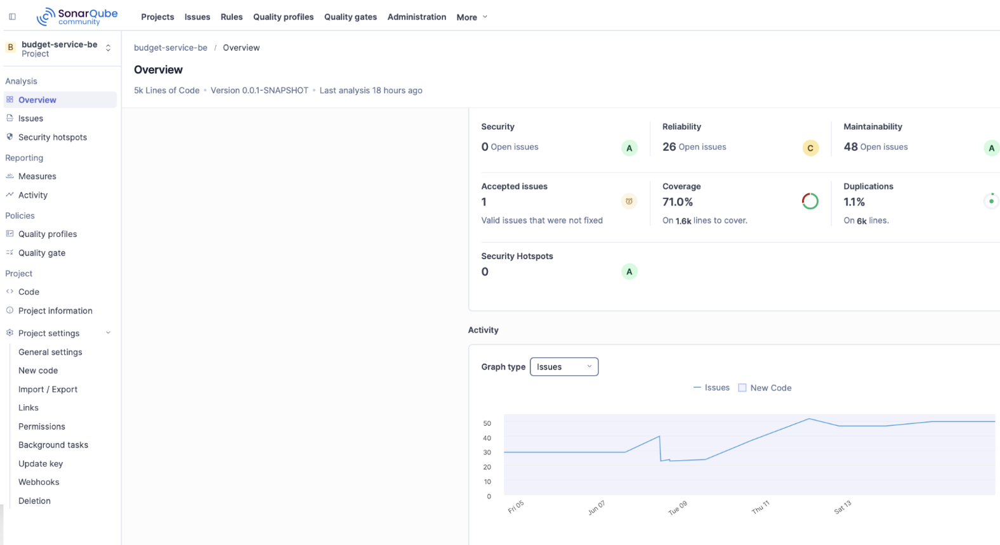
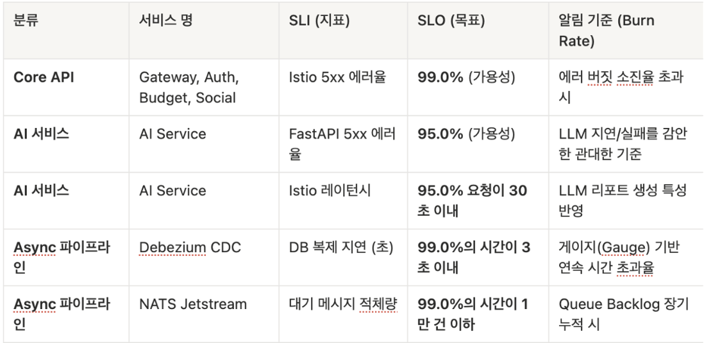
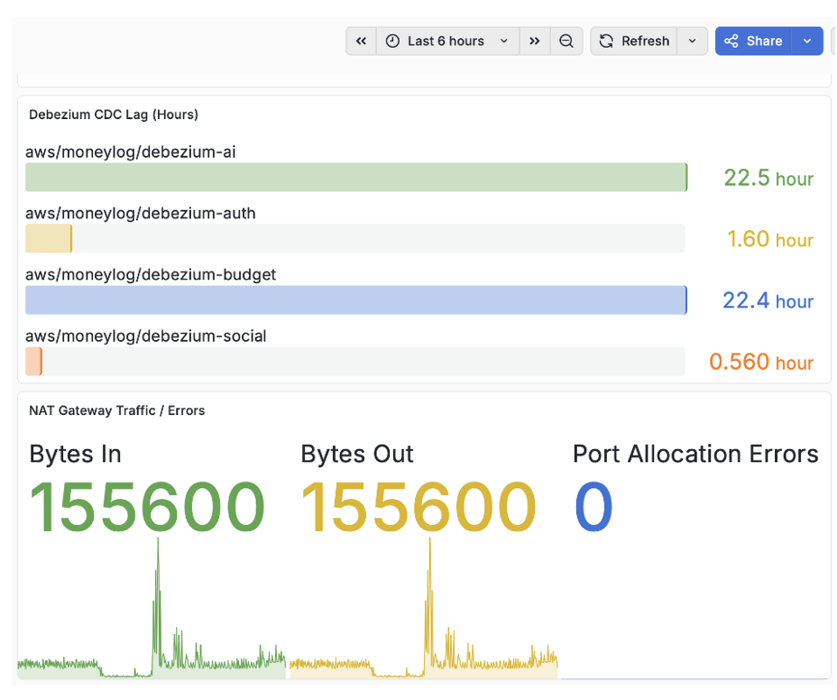

# Payment API Event Server

Spring Boot 기반 결제 이벤트 발행 마이크로서비스입니다. 현재 PostgreSQL, H2, NATS JetStream을 사용하여 결제 트랜잭션을 수집하고 Outbox 패턴 기반의 신뢰성 있는 이벤트를 메시지 큐에 발행합니다.

## 기술 스택

- Java 17
- Spring Boot 3.5.14
- Spring Data JPA
- PostgreSQL / H2 Database
- NATS JetStream (jnats 2.25.2)
- Springdoc OpenAPI / Swagger UI
- JUnit 5 / ArchUnit

## 아키텍처 및 워크플로우

<div align="center">
  
</div>

---

## 현재 구현 상태

### 결제 트랜잭션 수집 (Payment & Simulation)

- 결제 식별자(ID) 및 이벤트 ID는 외부 연동 규격을 고려한 포맷을 따릅니다.
- 내부적으로 사용자의 가상 결제를 발생시키는 스케줄러(`PaymentSimulationScheduler`)와 API를 지원합니다.
- 사용자별 결제 상태 및 누적 결제 모니터링 기능을 제공합니다.

### 안전한 이벤트 발행 (Outbox Pattern)

- 결제 도메인 테이블 기록과 메시지 발행용 **Outbox 테이블 기록을 동일한 트랜잭션**으로 처리합니다.
- NATS 장애 시 메시지가 소실되지 않으며, 장애 복구 후 `PaymentEventOutboxPublisher`가 미발행된(Unpublished) 이벤트를 안전하게 전송합니다.
- 데드 레터 큐 및 재시도(Retry) 메커니즘을 적용할 수 있는 데이터 신뢰성 기반을 갖추었습니다.

### 마이크로서비스 통신

- `NATS JetStream`을 연동하여 타 마이크로서비스(Budget, Social)로 결제 승인/취소 이벤트를 비동기로 발행합니다.
- 등록된 카드 정보 등 데이터 유효성 검증은 내부 서비스 호출 및 `MainProjectPaymentEventClient` 연동을 통해 처리됩니다.

## 주요 API

| Method | Endpoint | 설명 |
|---|---|---|
| POST | `/api/v1/payment-simulations/generate` | 단건 결제 이벤트 생성 (시뮬레이션) |
| POST | `/api/v1/payment-simulations/send` | 단건 결제 이벤트 생성 및 발행 |
| POST | `/api/v1/payment-simulations/send/all` | 등록된 모든 카드 대상 결제 이벤트 발행 |
| POST | `/api/v1/payment-simulations/send/bulk` | 대량 결제 이벤트 생성 및 발행 |
| POST | `/api/v1/payment-simulations/users/{userId}/send/bulk` | 특정 사용자의 대량 결제 이벤트 발행 |
| POST | `/internal/v1/users/{userId}/budget-sync/activate` | 사용자 예산/결제 동기화 활성화 |
| POST | `/internal/v1/users/{userId}/budget-sync/deactivate` | 사용자 예산/결제 동기화 비활성화 |
| POST | `/internal/v1/cards` | 신규 카드 등록 |
| GET | `/internal/v1/cards` | 등록된 카드 목록 조회 |
| DELETE | `/internal/v1/cards/{cardId}` | 등록된 카드 삭제 |

## 로컬 실행

### 필수 인프라

- PostgreSQL
- NATS Server

`application.yaml`에는 실제 운영 비밀값을 넣지 않습니다. 로컬/운영 실행 시 환경변수를 통해 주입합니다.

```powershell
$env:SPRING_DATASOURCE_URL="jdbc:postgresql://localhost:5433/payment_db"
$env:SPRING_DATASOURCE_USERNAME="postgres"
$env:SPRING_DATASOURCE_PASSWORD="postgres"
$env:NATS_SERVER="nats://localhost:4222"
```

실행:

```powershell
.\gradlew.bat bootRun
```

## DB 적재 방식

### payment_event & payment_event_outbox

결제 정보가 기록됨과 동시에 메인 트랜잭션 내에서 outbox가 쌓입니다.

```text
payment_event_id          = 결제 이벤트 내부 식별자
external_payment_event_id = 외부 제공사 결제 이벤트 식별자
card_id                   = 결제에 사용된 카드 식별자
user_id                   = 결제 사용자 식별자
amount                    = 결제 금액
created_at                = 생성 일시 (UTC)
```

```text
outbox_id                 = 아웃박스 식별자
payment_event_id          = 연관된 결제 이벤트 ID
external_payment_event_id = 외부 이벤트 식별자
status                    = 전송 상태 (READY, PUBLISHED, FAILED 등)
published_at              = 실제 NATS 발행 일시
```

---

## CI/CD 및 모니터링

GitLab 커밋 시 Jenkins를 통해 `코드 검사(SonarQube) -> 빌드 -> EKS 배포`가 자동화되어 있습니다.

<div align="center">
  
  
</div>

<div align="center">
  
  
</div>

- **데이터 스트리밍**: `Debezium`을 활용한 CDC 기반 비동기 데이터 동기화를 처리할 수 있도록 인프라가 설계되어 있습니다.
- **모니터링**: Prometheus와 Grafana를 통해 서비스 상태 및 메트릭을 실시간으로 추적합니다.

<div align="center">
  
</div>

---

## Swagger

서버 실행 후 아래 경로에서 API 명세를 확인할 수 있습니다:

```text
http://<payment-api-event-server-host>/swagger-ui.html
```

## 테스트

```powershell
.\gradlew.bat test
```
